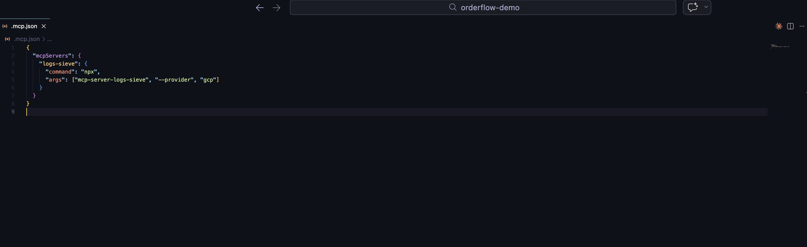
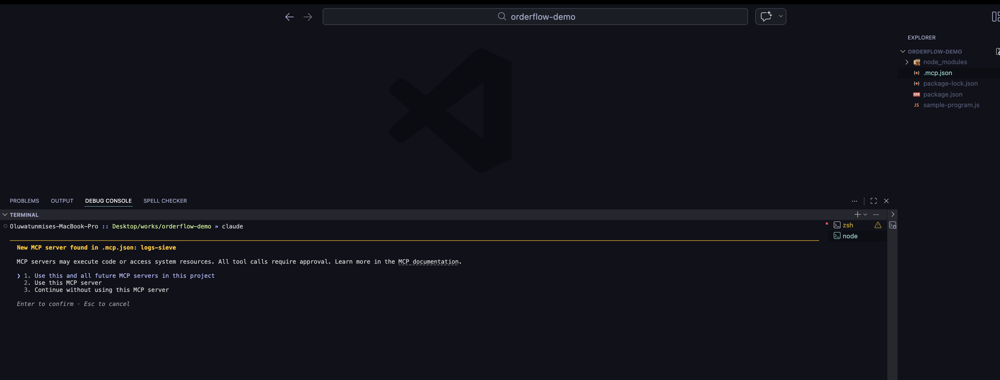
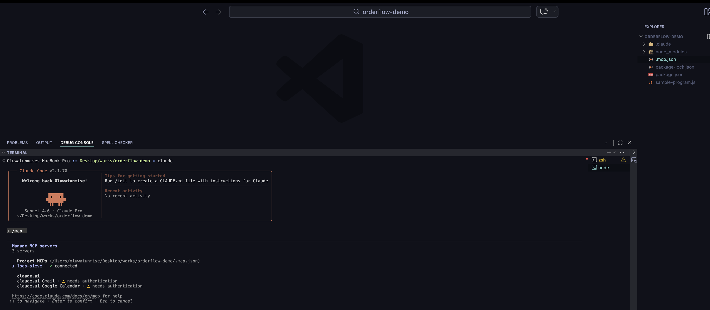
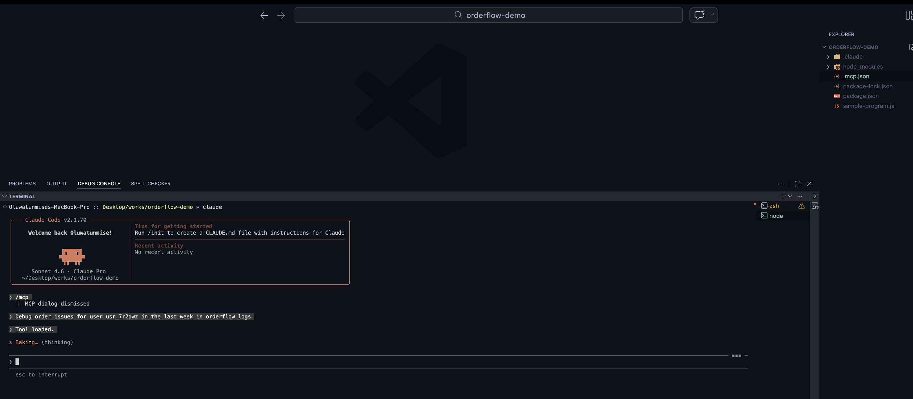
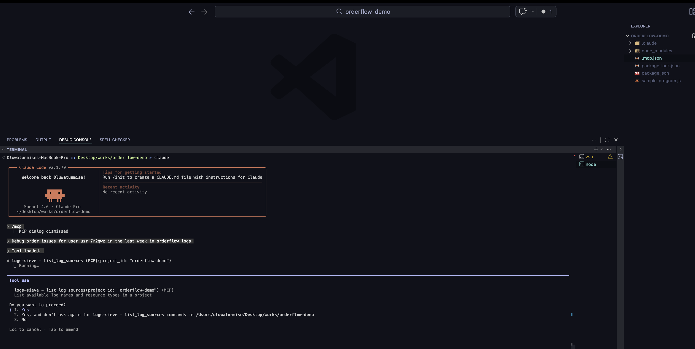
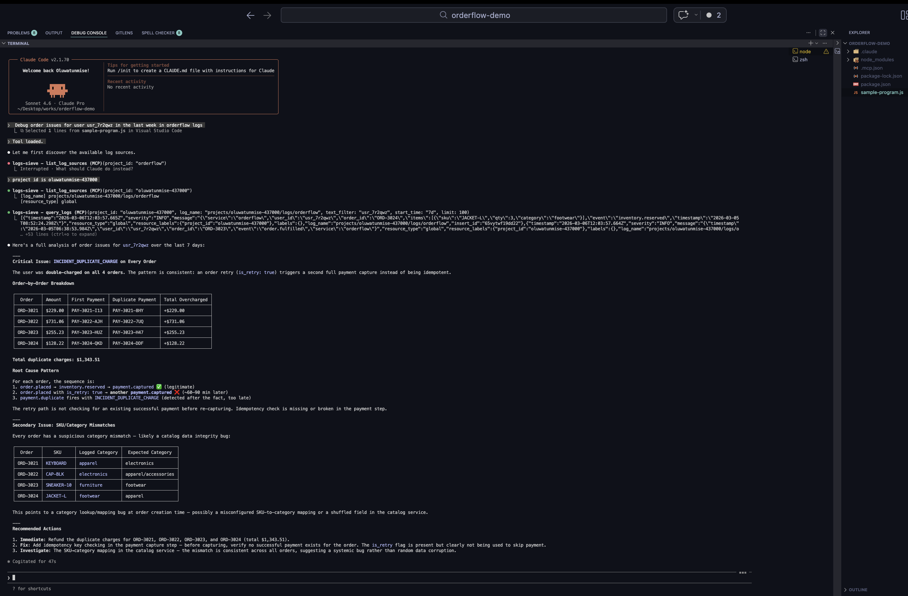

# Getting Started

This guide gets `mcp-server-logs-sieve` working in a fresh project quickly.

## Prerequisites

- Node.js 20+
- An MCP client (for example Claude Code)
- Access to at least one supported log backend

## 1. Add MCP config

Create `.mcp.json` in your project root:

```json
{
  "mcpServers": {
    "logs-sieve": {
      "command": "npx",
      "args": ["-y", "mcp-server-logs-sieve@latest", "--provider", "gcp"]
    }
  }
}
```

If you are developing this repository source directly, use:

```json
{
  "mcpServers": {
    "logs-sieve": {
      "command": "node",
      "args": ["./bin/mcp-server-logs-sieve.js", "--provider", "gcp"]
    }
  }
}
```

Swap `gcp` for `aws`, `azure`, `loki`, or `elasticsearch` when needed.

## 2. Set provider auth

Pick the page for your provider and set credentials:

- [GCP setup](./providers/gcp.md)
- [AWS setup](./providers/aws.md)
- [Azure setup](./providers/azure.md)
- [Loki setup](./providers/loki.md)
- [Elasticsearch setup](./providers/elasticsearch.md)

## 3. Restart MCP client

Restart your MCP client so it picks up `.mcp.json`.

Claude Code example:

1. Stop the current Claude Code session (`Ctrl + C`).
2. Start Claude Code again from the same project directory:

```bash
claude
```

3. In Claude Code, run:

```text
/mcp
```

4. Confirm `logs-sieve` appears in the MCP server list.

## 4. Make your first call

Try this in your MCP client:

```text
Call list_log_sources with scope "my-project-id"
```

Change the scope value for your provider:

- GCP: GCP project ID
- AWS: AWS region (for example `us-east-1`)
- Azure: Log Analytics workspace ID
- Loki: base URL (for example `http://localhost:3100`)
- Elasticsearch: base URL (for example `http://localhost:9200`)

## Next

- Learn each tool in [Tools](./tools/query-logs.md)
- Follow a realistic flow in [Debug Payment Failures](./guides/debug-payment-failures.md)
- If something is off, check [Troubleshooting](./troubleshooting.md)

## Visual walkthrough (Claude Code)

1. Add MCP config  


2. Claude Code startup prompt  


3. Confirm server via `/mcp`  


4. Ask your debugging question  


5. Approve tool permission prompt  


6. Review structured results  


## Developing this repository locally

If you are working on this repository itself:

```bash
npm install
npm run build
```
